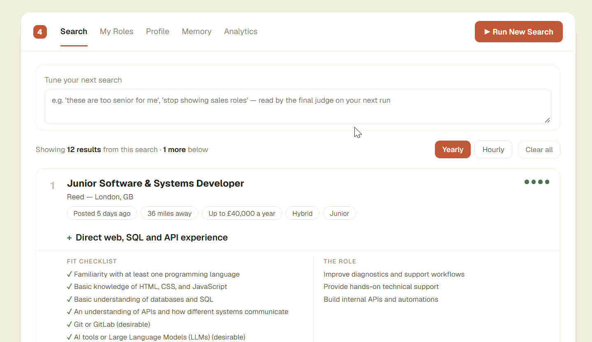

# AI Job Hunter

Originally made to be commercial- but since I couldn't find many users, I'm making it public.

**Point it at your CV. It makes a profile from it, reads a ton of job listings, and writes you a short list with its reasoning attached.**

Self-hosted, bring-your-own-API-key. Modified to no longer need an account.



*Each card is a real posting for my profile.*
📹 **[Full 23-second walkthrough](multimedia/full-v2.mp4)**

---

## How to use

**You need:** Python 3.11+ and an AI API key. (should install dependencies itself on first run)

### 0. Clone- no releases currently.
It will run locally.

### 1. Add your keys

```bash
cp .env.example .env
```

Open `.env` and fill. **Only an AI key is required.** 
Adding extra job boards like reed or adzuna improve performance however.

| Key | Get it | Why |
|---|---|---|
| **`OPENAI_API_KEY`** | [platform.openai.com/api-keys](https://platform.openai.com/api-keys) | **Required.** Or `ANTHROPIC_API_KEY` — see *Choosing models* below |
| **`REED_API_KEY`** | [reed.co.uk/developers/jobseeker](https://www.reed.co.uk/developers/jobseeker) | **Most important board for the UK.** Free, instant. Also supplies full job descriptions, which improves everything downstream |
| **`ADZUNA_APP_ID`** + **`ADZUNA_APP_KEY`** | [developer.adzuna.com](https://developer.adzuna.com/) | **Second most important.** Free, 20+ countries. Needs both values |
| **`RAPIDAPI_KEY`** | [JSearch on RapidAPI](https://rapidapi.com/letscrape-6bRBa3QguO5/api/jsearch) | **Third.** Subscribe to the free tier, then copy the key from your dashboard. A Google-for-Jobs mirror |
| `SERPER_DEV_API_KEY` | [serper.dev](https://serper.dev/) | 2,500 free queries. Finds postings on company sites the aggregators miss. This is the *active* Google provider |
| `SERPAPI_KEY` | [serpapi.com](https://serpapi.com/) | 100 free searches/month. Only used if serper.dev isn't set |
| Careerjet | — | **No key needed**, works out of the box. Register your own affiliate id at [careerjet.com/partners/api](https://www.careerjet.com/partners/api) for anything beyond personal use |
| `USAJOBS_API_KEY` + `USAJOBS_USER_AGENT` | [developer.usajobs.gov](https://developer.usajobs.gov/APIRequest) | US federal roles only |

If you add **nothing but the AI key**, it still works.

### 2. Start it

**Windows** — double-click **`start.bat`** file.

**macOS** — double-click **`start.command`** (or `./start.sh` in a terminal)

**Linux** — `./start.sh`

First run installs dependencies and a headless Chromium (~150MB, used for
reading job pages); it takes a few minutes. After that, pass `--no-setup`
(`-NoSetup` on Windows) to skip straight to launching.

Then open **<http://localhost:3000>**. The backend runs on
**<http://127.0.0.1:8000>** with interactive API docs at `/docs` — you only need
it if something goes wrong.

### 3. Onboarding

1. **Upload or paste your CV.**
2. **Check the criteria.**
3. **Press ▶ Run New Search.**
A full run takes **3–5 minutes**.

---

## Choosing models

Which provider runs is inferred from the **model name**, per tier — so you can
mix vendors. Anything containing `claude` goes to Anthropic; everything else
goes to OpenAI.
What I ran with:

```bash
ENGINE_CHEAP_MODEL=gpt-5.4-nano-2026-03-17   # screen gate — highest volume by far
ENGINE_MID_MODEL=gpt-5.6-luna                # 0-100 fit scorer
ENGINE_EXP_MODEL=gpt-5.6-terra               # final judge — 1-3 calls, spend here
ENGINE_EMBED_MODEL=text-embedding-3-small    # semantic pre-filter
```

> ⚠️ **The committed defaults are OpenAI model names**, and they're the specific
> ones this pipeline's prompts were tuned against. **If you aren't using an
> OpenAI key — or your key can't reach these exact models — you must change all
> four**, or every run fails.
>
> It fails *quietly*: a model call that errors is caught by a deliberate
> fail-open path, so the search completes and returns nothing useful rather than
> reporting an auth error. The server prints the full routing at startup so you
> can catch this before spending a run on it.

An all-Anthropic setup:

```bash
ENGINE_CHEAP_MODEL=claude-haiku-4-5-20251001
ENGINE_MID_MODEL=claude-sonnet-5
ENGINE_EXP_MODEL=claude-opus-5
EMBEDDING_PROVIDER=voyage        # Anthropic has no embeddings API
VOYAGE_API_KEY=...               # ...or keep an OpenAI key just for embeddings
```
Note: needs adapting if you want local embeddings (which is a few hundred megabytes so plausible here).

Any OpenAI-compatible server (OpenRouter, Groq, Together, LM Studio, Ollama)
works via `OPENAI_BASE_URL`. See `llm_providers.py` — it's one small file, and
every provider difference that matters is documented in it.

**Feel free to request improvements for usability in issues- if I'm still maintaining the project, I'll make the changes.**

---

## Cost

**Roughly 200,000 tokens per search run.** (most used by the cheapest AI- so not mega expensive to run)

| Tier | Share of tokens | Why |
|---|---|---|
| Cheap screen | ~85–90% | Hundreds of listings, batched 20 to a call |
| Mid scorer | ~8% | Only what survives the screen |
| Expensive judge | ~3% | 1–3 calls, but each carries a ~12k-token system prompt |
| Embeddings | negligible | Cached forever per job; a repeat run re-embeds nothing |

So the headline number is dominated by the *cheapest* model, which is the whole
point of the funnel. On current OpenAI pricing a run lands in the **single-digit
cents**; on an all-frontier-model setup it would be dollars. Prompt caching is
used throughout (the judge's fixed prefix is cached for 24h), and the Settings →
Analytics page reports the per-stage cache hit rate so you can see whether it's
landing.

**A repeat run is cheaper than the first.** Embeddings, scraped job text and
judge verdicts are all cached per job and reused until you edit your profile —
which is what deliberately invalidates them.

`MAX_SEARCHES_PER_DAY` (default 6) is the hard stop.

---


## What it actually does

Job boards match on keywords, so searching "data analyst" returns a thousand
listings of which maybe four are worth an application.

This runs a **three-tier funnel** over every listing it can find, to give a much higher fraction of good roles.


1. **Discovery** — pulls listings from every job board you have a key for, plus
   ~1,800 company ATS boards (Greenhouse, Lever, Ashby, Workable and friends)
   that need no key at all. A few thousand postings.
2. **Embedding pre-filter** — free, offline cosine similarity against your target
   roles. Plus a set of deterministic checks that cost nothing and are wrong to
   pay a model for: wrong country, plainly-senior titles, placement years,
   board category pages that aren't jobs at all. Removes ~65%.
3. **Cheap model screen** — a batched eight-axis check: is this even one job
   posting, is it the right *function*, the right level, does it clash with your
   stated non-negotiables. Hundreds of listings, cheapest model, highest volume.
4. **Mid model scoring** — a 0–100 fit estimate per surviving listing.
5. **Full-text fetch** — for the best candidates, fetches the actual job page
   (most board APIs return only a ~500-character teaser, which is the company
   blurb, never the requirements).
6. **Expensive judge** — reads the full descriptions and writes what you see:
   a requirements checklist ticked against your evidence, what the role really
   filters on, and the honest weakest link. 1–3 calls per run.

Then some things it also attempts/ does:

- **Liveness verification** — every role shown is re-fetched and confirmed still
  open before it reaches you. A measured 26% of already-surfaced listings were
  already dead.
- **Ghost-listing detection** — flags adverts with no real vacancy behind them
  (talent pools, months-old reposts, take-down-and-relist patterns) as named
  reasons, never an unexplained score.
- **Visa sponsorship** (UK) — checks the employer against the Home Office
  register of licensed sponsors *and* what the listing itself says, which
  disagree more often than you'd think.
- **Commute distance, salary normalisation, listing age** — a bare postcode
  becomes a real distance; "£200 per day" and "up to 70k" become comparable
  numbers.
- **Feedback** — ticking and crossing roles nudges per-attribute weights. There's
  no retraining; it just changes what floats to the top next time.

---

## Tuning

Everything below is optional and lives in `.env`. Defaults are tuned against a
live store; each constant's own comment in the source records the measurement
behind it.

| Variable | Default | What it does |
|---|---|---|
| `RANK_EXAMINE_BUDGET` | 480 | **The main cost dial.** How many listings the cheap model examines per run. Lower = cheaper and shallower |
| `JUDGE_POOL` | 40 | How many reach the expensive judge. Main driver of judge-tier spend |
| `RANK_TARGET_POOL` | 80 | How many the mid tier aims to approve |
| `RANK_REJECT_SCORE_FLOOR` | 32 | Below this 0–100 fit score, drop before the judge |
| `FINAL_PICKS` | 12 | Max roles shown per run |
| `MIN_RESULTS` | 3 | Per-role-family floor |
| `RELEVANCE_PRIMARY` / `RELEVANCE_FLOOR` | 0.39 | Embedding cutoff to enter the pool at all. Raise to search narrower |
| `MAX_SEARCHES_PER_DAY` | 6 | Hard daily cap |
| `MAX_CONCURRENT_SEARCHES` | 2 | Really a memory ceiling — each run drives its own Chromium |
| `REED_PAGES_PER_TERM` / `ADZUNA_PAGES_PER_TERM` | 3 | Discovery depth. Paid in latency before the first cards appear |

**Settings → Analytics** shows where the last run's time went phase by phase, the
full funnel (how many listings survived each stage, and why the rest didn't), and
a random sample of what was actually at each stage with URLs. It's read-only and
costs nothing — it reports numbers the run already recorded.

---

## How it's built

```
full_auto.py          The search engine: discovery, the model prompts, scraping.
                      One big module, pre-existing, deliberately not refactored.
llm_providers.py      OpenAI/Anthropic shim. Every provider difference lives here.
backend/              FastAPI + SQLAlchemy (SQLite). Wraps the engine behind one
  app/                service boundary (services/engine.py is its only importer).
    models.py         profiles, attributes, roles, jobs_seen, search_runs
    routers/          profiles, attributes, families, onboarding, search, settings
    services/         snapshot (profile → engine input), engine, formation,
                      ghost, sponsors, geo, salary, observe, ...
frontend/             Next.js (App Router) + TanStack Query
scripts/              Maintenance: the daily observation pass, liveness re-checks,
                      the direct-employer crawl, offline backfills
tests/                Calibration harnesses (gate, judge) — not a unit-test suite
```

**Deployment**: there isn't one. This is built to run on your own machine. The
old hosted config (Fly/Render/Vercel/Docker) is kept under `archive/` but
configures a login system that no longer exists, so it is not a working starting
point as-is.

**Runtime**: one Python process, one Node process, one SQLite file
(`backend/jobmatch.db`, created on first boot). Schema changes are a hand-rolled
idempotent `ALTER TABLE ADD COLUMN` dict in `database.py`, not Alembic.

**There is no login.** It runs as a single local user. Every table still carries
a `user_id` and every ownership check goes through one function
(`deps.current_user_id`), so multi-user is a drop-in — but an account system
would protect nothing here, since anyone who can reach the port can already read
the database file beside it. **If you expose this beyond localhost, put an
authenticating proxy in front of it.**

**`CLAUDE.md`** is the real engineering documentation — a long, unusually
detailed record of what was measured, what was tried and failed, and why each
constant is the number it is. If you want to change any of this, read the
relevant section first; most of the obvious improvements have already been tried
and are documented as *not* working.

### Where your data lives

Everything the app generates goes in one gitignored directory:

```
data/
  jobmatch.db        your profiles, roles, feedback and the jobs_seen store
  boards_cache.db    the engine's cached screen/rank verdicts
  exp.txt            the CV text the final judge reads, rewritten each run
  raw_api_jobs.json  raw discovery dump (set DEBUG_SAVE_RAW=0 to skip it)
```

So a clean slate is `rm -rf data/`, and nothing generated can reach a commit.

To run a throwaway test without touching your real data at all, point `DATA_DIR`
somewhere else for that run — all four files follow it:

```bash
DATA_DIR=/tmp/jobhunter-test venv/bin/python -m uvicorn app.main:app --app-dir backend --port 8000
```

Individual overrides (`DATABASE_URL`, `CV_PATH`, `BOARDS_CACHE_DB`,
`RAW_API_JOBS_PATH`) take precedence over `DATA_DIR` if you need to split them up.
Harness reports under `tests/*_reports/` are separate — those take an `--out-dir`
flag and are gitignored too.

If you are upgrading an install that predates `data/`, your existing
`backend/jobmatch.db` keeps being used and is **not** moved or orphaned; only
fresh installs start in `data/`.

### Optional: scheduled background work

Two things benefit from running daily, and neither costs AI credits:

```bash
venv/bin/python scripts/observe_listings.py    # track which listings are still up
venv/bin/python scripts/recheck_liveness.py    # mark dead listings dead
```

The first feeds ghost detection, and **daily really matters** — the evergreen
rule divides days-seen by days-since-discovery, so a gap suppresses the signal
rather than delaying it. Point cron, systemd or Task Scheduler at them. There's
deliberately no in-process scheduler.

---

## Known limitations

Worth being straight about these:

- **Setup is unwieldy.** Two runtimes, a headless browser, and a handful of API
  keys. This is a tool that was built for its author to use, published because
  public is better than private — not a product.
- **Best tuned for the UK.** Commute distances use ONS postcode data, the visa
  filter uses the Home Office sponsor register, and Reed is UK-only. Everything
  else is country-agnostic, and Adzuna covers 20+ countries.
- **The prompts are tuned to specific models.** See the warning above.
- **No test suite.** `tests/` holds calibration harnesses that measure prompt
  behaviour against a live database; there is no pytest/jest setup.
- **Scraping is best-effort.** Some sites block it. Those listings fall back to
  their API snippet, and the judge is told when it's working from a truncated
  teaser rather than the real posting.

---

## Licence

MIT — see [LICENSE](LICENSE).
